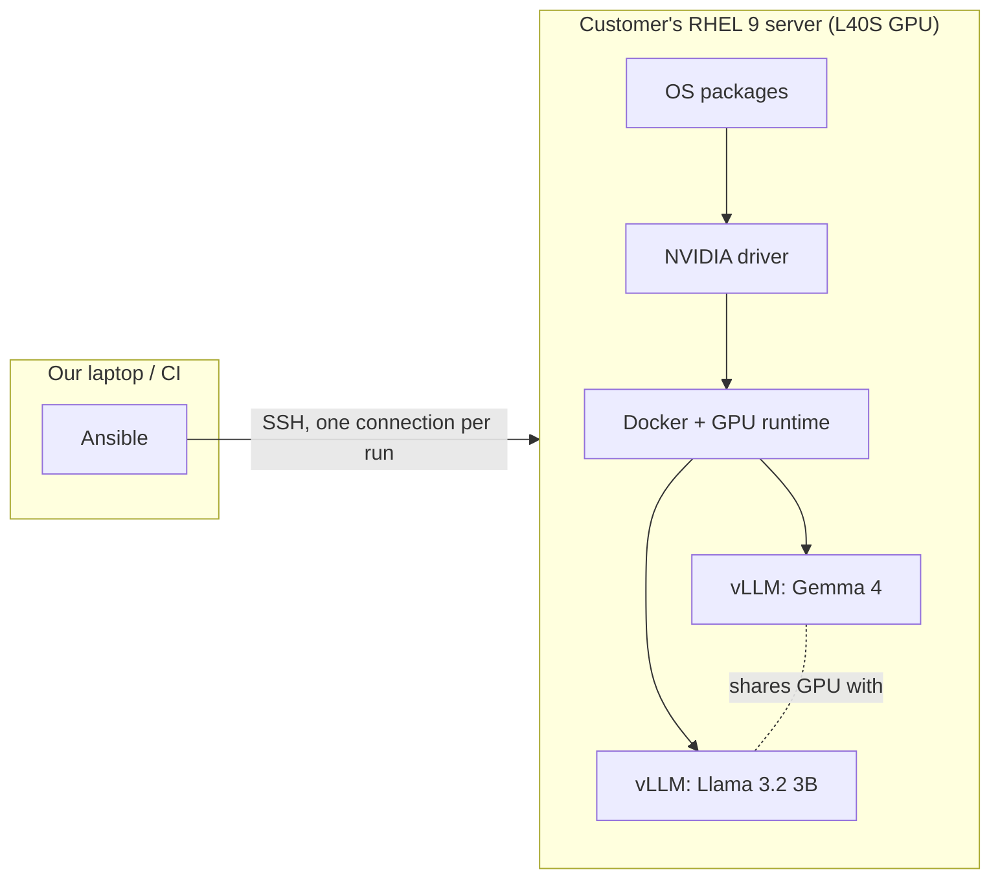
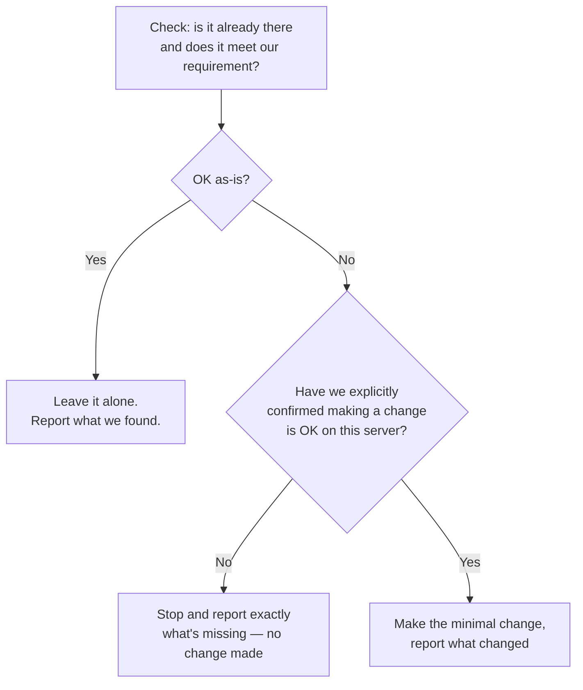
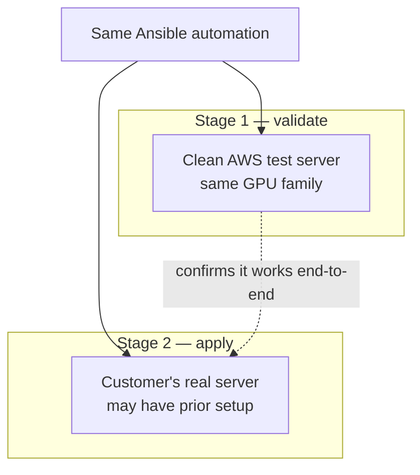

# Executive overview

## What this is

We're standing up a repeatable, automated way to deploy two AI model servers side by
side on a single customer GPU server, so we can benchmark different configurations and
then hand the customer a system we can support and re-deploy reliably — instead of a
one-off, hand-configured box.

- **Two models, one server**: Gemma 4 (a larger, mixture-of-experts model) and Llama
  3.2 3B (a smaller model), each served by its own instance of vLLM (an open-source,
  high-performance model-serving engine), sharing one NVIDIA L40S GPU.
- **Automated, not hand-built**: the entire setup — OS packages, GPU driver, container
  runtime, and the two model servers — is defined as code (Ansible) so it can be
  torn down and rebuilt identically, and so configuration changes (which model gets
  more GPU memory, which flags each model runs with) are a data change, not a manual
  server edit.
- **Two-stage rollout**: we validate the automation end-to-end on a disposable AWS
  test server first, then apply the same automation to the customer's real server.
- **Models are mounted, not downloaded**: the full model files are assumed to already
  be present on the server; the automation points each vLLM instance at the local copy
  rather than fetching anything over the network at deploy time.

## How it works, at a glance

**Agentless**: nothing is installed on the customer's server to make this automation
work. We connect over standard SSH, run the setup, and disconnect — there's no
persistent background service, dashboard, or agent left behind. Re-running later to
change a configuration is the same: connect, apply, disconnect.

## The safety principle: check before we touch anything

This is a server we don't fully control the history of — it may already have a GPU
driver, Docker, firewall rules, or security policy configured by the customer or a
previous vendor. Every step that would change something checks current state first
and only proceeds if we've explicitly confirmed it's safe to do so.

This applies to every layer: the GPU driver, Docker, the firewall, the SELinux
security policy, and even how much GPU memory is already in use by something else.
Nothing is installed, upgraded, or reconfigured on the customer's server by surprise.

## Two environments, same automation

The AWS box is disposable, so we let the automation manage everything there —
including a from-scratch driver install — to prove the whole flow works. Nothing is
applied to the customer server until that's validated, and even then, the customer run
starts in report-only mode (see above) so we see exactly what's already on the box
before changing anything.

## What's configurable (for benchmarking later)

Once the base setup is in place, per-model settings — which share of GPU memory each
model gets, request length limits, and other serving parameters — are all adjustable
without touching server configuration by hand. That's the point: re-running the
automation with a different setting is how we'll compare configurations.

## Current status

- Automation scaffolding is in place and reviewed; not yet run against real hardware.
- The exact on-disk location of each model repo on the customer's server is
  intentionally left as a placeholder until we confirm it against the real server.
- Provisioning of the AWS test server is scripted (one command up, one command
  reset to a clean machine, one command teardown), with model storage on a
  separate disk so a machine reset doesn't require re-downloading models.
- Next step: bring up the AWS test server and do the first full run there.

See [architecture.md](architecture.md), [host-safety-model.md](host-safety-model.md),
and [model-tuning-and-placement.md](model-tuning-and-placement.md) for the
engineering-level detail behind this summary.
