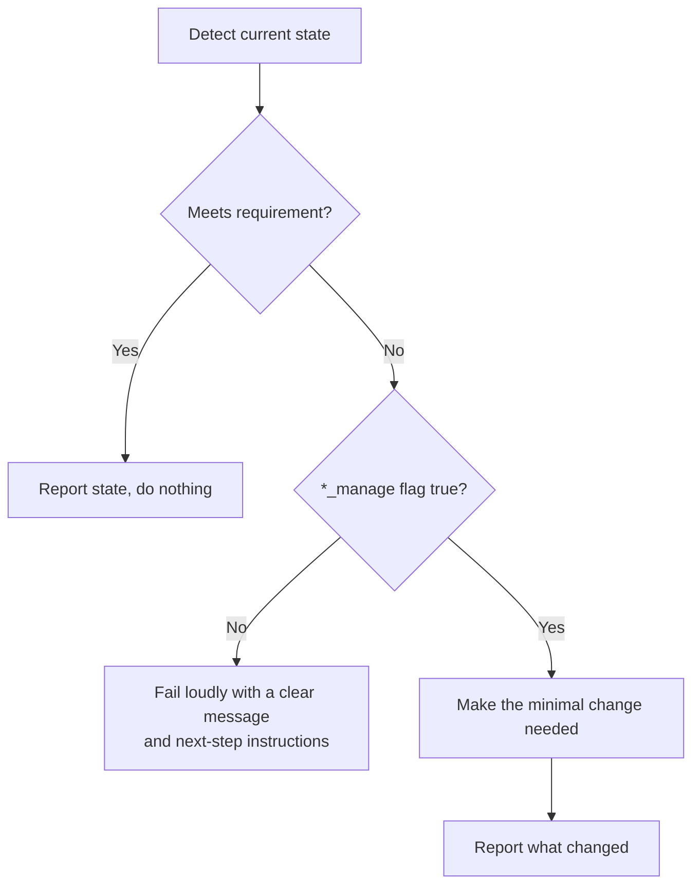

# Host safety model: detect-then-manage

## The problem, generalized

[docs/nvidia-driver-management.md](nvidia-driver-management.md) covers the NVIDIA
driver in detail because it's the highest-risk piece (kernel modules, reboots). But
the same problem — *this playbook may run against a server that already has things
configured outside of Ansible* — applies to everything this repo touches:

| Area | Role | What might already be there |
|---|---|---|
| NVIDIA driver | `nvidia_driver` | A driver version validated against other workloads |
| Docker engine | `docker` | A different version, custom daemon config, or a different container runtime entirely |
| NVIDIA Container Toolkit / GPU runtime | `docker` | Already installed and configured, possibly differently |
| firewalld | `common` | Intentionally disabled in favor of a cloud security group or external firewall |
| SELinux policy | `docker` | A booleans/context configuration the security team owns |
| GPU memory/compute | `vllm` | Other processes already using the GPU |

Blindly "installing" or "fixing" any of these on a customer's production server risks
breaking something that already works. So every one of these areas follows the same
pattern.

## The pattern



Every gated area has:

1. **A detection task** — runs a read-only command (`nvidia-smi`, `docker --version`,
   `systemctl is-active firewalld`, `getenforce`, `rpm -q ...`) and never fails the
   play by itself (`failed_when: false`). Detection tasks always carry
   `check_mode: false`: they're read-only, and a `--check` run that skips them
   computes every downstream fact from an empty register — the report-only run
   this repo's workflow depends on would describe a fictional host.
2. **A fact reported via `debug`** — so a `--check` run or a real run always shows you
   what was found, even when no change happens.
3. **A `*_manage` boolean variable** — `nvidia_driver_manage`, `docker_manage`,
   `firewalld_manage`, `selinux_manage`. Default `false` everywhere except the
   disposable `aws-test` inventory.
4. **A hard fail when the requirement isn't met and management is off** — with a
   message that says exactly what's missing/wrong and what variable to flip. This is
   deliberate: the playbook should stop and ask, not silently skip a step that vLLM
   needs to actually run.
5. **A gated `block` that makes the change** — only reached when management is
   explicitly turned on for that host.

Two exceptions:

- **GPU memory/compute capacity** (in the `vllm` role) is detection-only — there's
  nothing to "manage" about another process already using GPU memory, so it's always
  checked and only asserts (fails) if the numbers don't add up. The budget counts
  only processes **outside this deployment** — memory held by our own vLLM
  containers is excluded, since a re-apply recreates them (otherwise every config
  change on a healthy serving box would trip the guard against its own workload).
  See [vllm-configuration.md](vllm-configuration.md).
- **firewalld** (in the `common` role) doesn't hard-fail when absent and unmanaged:
  a host without firewalld isn't broken — it may rely on a cloud security group or
  an external firewall — so the role reports the skip (naming the vLLM ports that
  must be reachable some other way) and proceeds. The `firewalld_manage` flag gates
  install/enable: when true, the package is installed and the service
  started/enabled regardless of current state. Rules (the `ssh` service, explicitly,
  so a freshly enabled firewall can never cut off the playbook's own access path,
  plus each vLLM instance port) are applied whenever firewalld is active — whether
  it already was, or this role just enabled it.

## Why per-area flags instead of one global switch

A customer might be fine with Ansible installing Docker but want their security team
to review any SELinux policy change themselves. Splitting the flags
(`docker_manage` vs. `selinux_manage`) means you don't have to choose between "manage
everything" and "manage nothing" — each area is opted into independently, in
`ansible/inventories/<env>/group_vars/all.yml`.

## First run against any new host

Regardless of environment, treat the first run as **detection only**:

```bash
ansible-playbook -i inventories/<env>/hosts.yml playbooks/site.yml --check --diff
```

With every `*_manage` flag left at its default (`false` for anything other than
`aws-test`), this run can't change anything — it will report current state and fail
at the first gap it finds, telling you exactly what to review before opting in. Work
through the failures one at a time, deciding per-area whether to flip the flag or
handle that piece outside Ansible.
